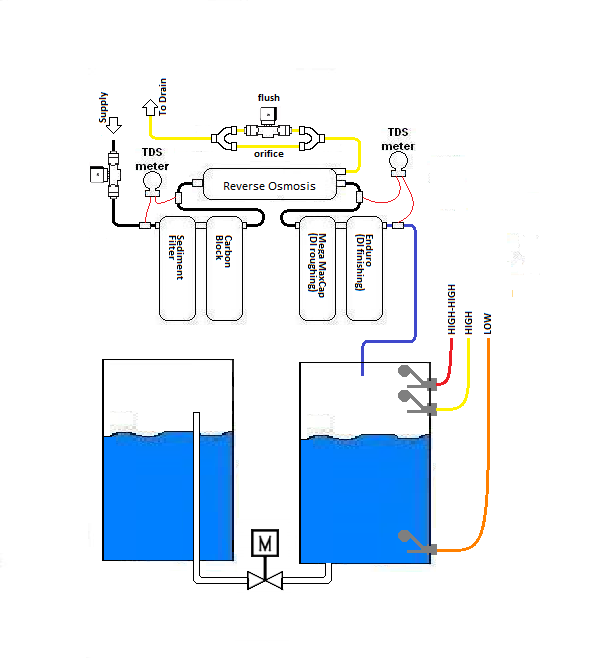

# Arduino-WaterBoard

An Arduino-based RO/DI water generator.

## Necessary Components
This revision only consists of:
- Float Switches (3)
- Dual-Relay board (1)
- 12V solenoids (2)

## Considerations
Each solenoid MUST have a flyback diode installed. Otherwise, the High-High sensor is tripped when the relays are powered off.

Only two relays are mandatory for RO/DI unit operation. The other relays in the code are not currently attached, but for future use.

## Operation
My RO/DI unit has two manual valves.
 - "Main" supply valve
 - "Flush" valve
 
Startup operation of the RO/DI Unit requires a specific sequence:
 1. Ensure the "Flush" valve is open.
 2. Open "Main" supply valve.
 3. After flushing the RO filter for 60 seconds, Close the "Flush" valve.

Likewise, on Shutdown:
 1. Open the "Flush" valve.
 2. After 60 seconds, close the "Main" supply valve.
 3. Ensure the "Flush" valve is left open while system is off.

## Diagram

